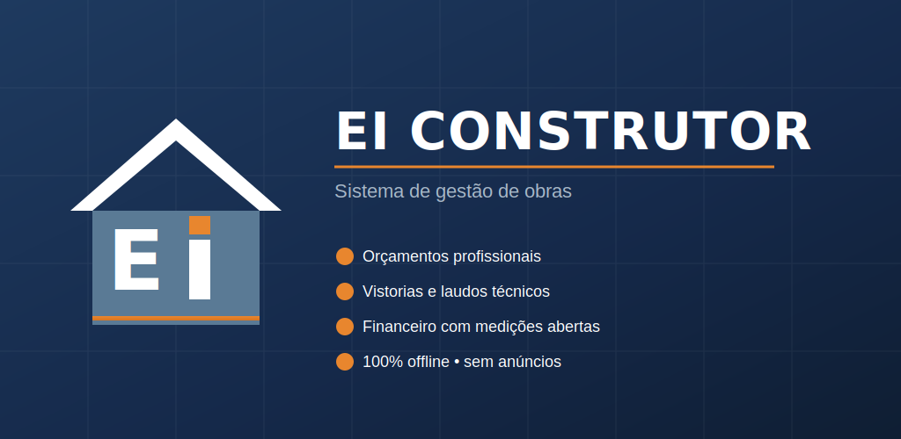

[](https://doi.org/10.5281/zenodo.20947329)

# EI Construtor

**Sistema offline de gestão de obras para profissionais da construção civil.**

## Links do Projeto
* **Aplicativo Web (PWA):** https://edsondionizio77-dot.github.io/ei-construtor/
* **Versão Android:** Em breve na Google Play Store (Gerado via PWABuilder)

Aplicativo Progressive Web App (PWA) para gestão completa de orçamentos, contratos, financeiro, vistorias técnicas, laudos periciais e manual normativo de obra. Funciona 100% offline — todos os dados são armazenados localmente no dispositivo do usuário, sem necessidade de servidor ou conexão à internet.

**Projeto pessoal de Edson Alves Dionizio** — pesquisa e desenvolvimento em tecnologia aplicada à construção civil. Distribuído gratuitamente.



---

## Características técnicas

- **Arquitetura:** Single-Page Application (SPA) em HTML5 + CSS3 + JavaScript puro (vanilla JS)
- **Distribuição:** Arquivo HTML único (`index.html`) + Service Worker + Manifest PWA
- **Armazenamento:** localStorage do navegador (até ~10 MB de dados estruturados)
- **Imagens:** comprimidas automaticamente para JPEG 75% qualidade, máx 1280px
- **Compatibilidade:** Android 7.0+, iOS 14+, navegadores modernos (Chrome, Edge, Firefox, Safari)
- **Tamanho do app:** ~400 KB instalado, ~50 MB em uso médio com fotos

---

## Funcionalidades principais

### Orçamentos profissionais
- Geração de orçamentos com cabeçalho da empresa, itens detalhados, descontos
- Quatro modos de exibição protegendo unit pricing
- Compartilhamento via Web Share API (WhatsApp, e-mail)

### Contratos e Recibos
- Contrato de prestação de serviços gerado a partir do orçamento aprovado
- Recibos com numeração sequencial por contrato
- Assinatura digital por canvas HTML5
- Valor por extenso e data extensa

### Financeiro com medições abertas
- Sistema de medições abertas (não parcelas fixas)
- Quinzenais (14º/29º dia para medição, 15º/30º para pagamento)
- Dashboard com KPIs: recebido, a receber, pendências
- Pagamentos parciais e por categoria

### Vistorias e Laudos Técnicos
- Documento factual (vistoria) ou pericial (laudo) — conversível a qualquer momento
- Numeração separada por categoria (V-001/AAAA e L-001/AAAA)
- Campo ART/RRT/TRT opcional
- Conclusão técnica dinâmica conforme categoria

### Monitoramento de Fissuras
Protocolo técnico com triangulação de 3 instrumentos:
- **Paquímetro** (largura absoluta) — métrica principal, alinhada à NBR 6118
- **Medidor de fissuras** (deslocamento relativo) — acompanha tendência
- **Selo de gesso** (verificação qualitativa) — atesta atividade da fissura

Classificação automática Thomaz/IPT:
- Fissura: ≤ 0,5 mm
- Trinca: 0,5–1,5 mm
- Rachadura: 1,5–5 mm
- Fenda: 5–10 mm
- Brecha: > 10 mm

Critérios de alarme:
- Paquímetro > limite wk da NBR 6118 conforme Classe de Agressividade Ambiental (CAA I a IV)
- Variação (Δ) > 0,10 mm entre leituras consecutivas
- Selo trincado ou rompido
- Propagação > 1 cm
- Divergência paquímetro/medidor > 0,15 mm (sugere descalibração)

### Manual Técnico
Mais de 20 fichas pré-populadas com referências normativas:
- Caimentos (áreas molhadas, calçadas, lajes)
- Concreto (fck, cobrimento, slump, cura, desforma)
- Hidráulica (alturas, declividades, diâmetros)
- Ergonomia (NR-17, NBR ISO/CIE 8995)
- Segurança (NR-18, NR-35, NR-6)
- Acessibilidade (NBR 9050)
- Desempenho (NBR 15575)
- Patologias (trincas, infiltração)
- Checklists (betonagem, impermeabilização, entrega)

Editor de fichas com tabelas dinâmicas, checklists, referências normativas e busca.

### Catálogo de Serviços e Materiais
- 130+ serviços pré-cadastrados (hidráulica, elétrica, alvenaria, estrutura)
- 65+ materiais (hidráulico, elétrico)
- Personalização de valores por região

---

## Normas técnicas de referência

- **NBR 6118:2014** — Projeto de estruturas de concreto (limites de fissuração para ELS-W)
- **NBR 16747:2020** — Inspeção predial — Diretrizes e procedimento
- **NBR 15575:2021** — Edificações habitacionais — Desempenho
- **NBR 5626:2020** — Sistemas prediais de água fria e quente
- **NBR 8160:1999** — Sistemas prediais de esgoto sanitário
- **NBR 9050:2020** — Acessibilidade a edificações
- **NBR ISO/CIE 8995-1:2013** — Iluminação de ambientes de trabalho
- **NR-6, NR-17, NR-18, NR-35** — Normas Regulamentadoras do Ministério do Trabalho
- **THOMAZ, E.** — *Trincas em edifícios: causas, prevenção e recuperação* (PINI/IPT)

---

## Como executar localmente

1. Faça download dos arquivos
2. Abra `index.html` em um navegador moderno
3. (Opcional) Sirva via HTTP local para habilitar Service Worker:
   ```bash
   python3 -m http.server 8000
   # Abra http://localhost:8000
   ```

---


## Estrutura de arquivos

```
ei-construtor/
├── index.html              # Aplicação principal (single-file)
├── manifest.json           # Manifesto PWA
├── service-worker.js       # Cache offline
├── privacy.html            # Política de privacidade
├── icons/                  # Ícones em múltiplos tamanhos
│   ├── icon-source.svg
│   ├── icon-72.png
│   ├── icon-96.png
│   ├── icon-128.png
│   ├── icon-144.png
│   ├── icon-152.png
│   ├── icon-192.png        # Padrão Android
│   ├── icon-384.png
│   └── icon-512.png        # Padrão Play Store
└── feature-graphic.png     # Banner do Play Store (1024×500)
```

---

## Privacidade

O EI Construtor é um aplicativo **100% offline**:

- Não coleta dados pessoais
- Não envia dados a servidores
- Não usa cookies de rastreamento
- Não exibe anúncios
- Não compartilha informações com terceiros

Todos os dados ficam armazenados exclusivamente no dispositivo do usuário, em `localStorage`. Backups manuais em JSON podem ser exportados pelo próprio aplicativo.

Política completa: [privacy.html](privacy.html)

---

## Licença e propriedade intelectual

**Autor / Titular:** Edson Alves Dionizio (pessoa física)
**Registro de Programa de Computador (RPC):** [pendente — INPI]
**Marca:** EI Construtor (em processo de registro)

Software desenvolvido como projeto pessoal de pesquisa e desenvolvimento em tecnologia aplicada à construção civil. Distribuição gratuita.

---

## Sobre o autor

**Edson Alves Dionizio** — Tecnólogo em Design de Interiores e Técnico em Edificações, com mais de 20 anos de experiência prática no ciclo completo da construção civil. Atualmente em formação simultânea nas graduações de Engenharia Civil e Arquitetura e Urbanismo, e especializando-se em Engenharia de Gerenciamento de Obras (UniFatecie). É autor técnico de obras em desenvolvimento focadas em ergonomia espacial, detalhamento altimétrico para áreas molhadas e controle de qualidade no canteiro de obras.

- CREA-BA nº 052407533-6
- CRT-BA nº 981894845-91
- ORCID: 0009-0001-8474-583X

Atua profissionalmente também por meio da **EI Construtora LTDA** (CNPJ 54.066.929/0001-42, Ilhéus/BA), empresa familiar de construção. O EI Construtor (este aplicativo) é projeto pessoal do autor, independente das atividades comerciais da referida empresa.

---

## Contato

- **E-mail:** edsondionizio77@gmail.com
- **Endereço para correspondência:** Praça José Marcelino, nº 100, Centro, Ilhéus/BA, CEP 45.653-754
